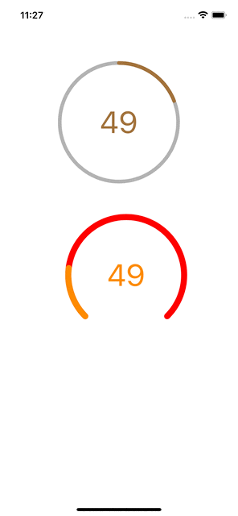

# MZCircleProgress
圆形进度条、弧形进度条

<div align=center>

</div>

#### Cocoapods 引入
```
pod 'MZCircleProgress', '~> 0.0.1'
```

#### 使用
```
let circleProgress = MZCircleProgress(frame: CGRect(x: 50, y: 100, width: 200, height: 200))
// 底条颜色
circleProgress.backLineColor = .red
// 底条宽度
circleProgress.backLineWidth = 10
// 进度条颜色
circleProgress.progressColor = .orange
// 进度条宽度
circleProgress.progressWidth = 10
// 中间文本框属性、可设置文字、文字颜色、字体
circleProgress.textLabel.textColor = .orange
circleProgress.textLabel.text = "10"
// 开始弧度
circleProgress.startAngle = CGFloat(-Double.pi / 4 * 5)
// 结束弧度
circleProgress.endAngle = CGFloat(Double.pi / 4)
// 进度比例（0～1）,可通过控制ratio来实现进度动画
circleProgress.ratio = 0.7
```
